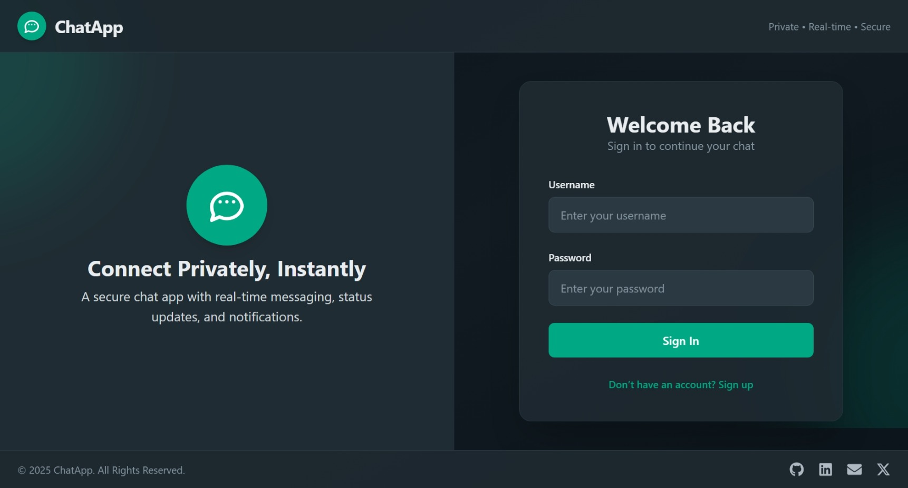

# 💬 ChatApp - Real-time Chat Application

A modern, real-time chat application built with the MERN stack (MongoDB, Express.js, React, Node.js) featuring Socket.IO for instant messaging, beautiful UI with Tailwind CSS, and enhanced user experience with glow effects and animations.



## ✨ Features

### 🚀 Core Functionality
- **Real-time messaging** with Socket.IO
- **User authentication** (Sign up, Login, Logout)
- **Secure password hashing** with bcryptjs
- **JWT-based authentication** with HTTP-only cookies
- **Responsive design** for all device sizes
- **Online status indicators** for users
- **Message status** (sent, delivered, read)

### 🎨 Enhanced UI/UX
- **Beautiful glow effects** and hover animations
- **Collapsible sidebar** with smooth transitions
- **Modern dark theme** with gradient backgrounds
- **Floating particles** and animated orbs
- **Interactive buttons** with colored shadows
- **Smooth animations** and transitions
- **Custom scrollbars** for better aesthetics

### 🔧 Technical Features
- **MongoDB** for data persistence
- **Express.js** backend with RESTful APIs
- **React 18** with modern hooks and context
- **Zustand** for state management
- **Vite** for fast development and building
- **Tailwind CSS** for styling
- **DaisyUI** components
- **React Router** for navigation
- **React Hot Toast** for notifications

## 🛠️ Tech Stack

### Backend
- **Node.js** - Runtime environment
- **Express.js** - Web framework
- **MongoDB** - Database
- **Mongoose** - ODM for MongoDB
- **Socket.IO** - Real-time communication
- **JWT** - Authentication tokens
- **bcryptjs** - Password hashing
- **cookie-parser** - Cookie handling

### Frontend
- **React 18** - UI framework
- **Vite** - Build tool
- **Tailwind CSS** - Styling
- **DaisyUI** - UI components
- **Zustand** - State management
- **React Router DOM** - Routing
- **React Icons** - Icon library
- **React Hot Toast** - Notifications
- **Socket.IO Client** - Real-time client

## 📋 Prerequisites

Before running this application, make sure you have the following installed:

- **Node.js** (v16 or higher)
- **npm** or **yarn**
- **MongoDB** (local installation or MongoDB Atlas)
- **Git**

## 🚀 Installation & Setup

### 1. Clone the repository
```bash
git clone https://github.com/ketaniiitn/Chat-Application.git
cd Chat-Application
```

### 2. Install root dependencies
```bash
npm install
```

### 3. Install frontend dependencies
```bash
cd frontend
npm install
cd ..
```

### 4. Environment Variables
Create a `.env` file in the root directory and add the following variables:

```env
PORT=5000
MONGO_DB_URI=your_mongodb_connection_string
JWT_SECRET=your_jwt_secret_key
NODE_ENV=development
```

**Example:**
```env
PORT=5000
MONGO_DB_URI=mongodb://localhost:27017/chatapp
JWT_SECRET=mysecretjwtkey123456789
NODE_ENV=development
```

### 5. Setup MongoDB
- **Local MongoDB:** Install MongoDB locally and make sure it's running
- **MongoDB Atlas:** Create a cluster and get your connection string

## 🏃‍♂️ Running the Application

### Development Mode

#### Option 1: Run both frontend and backend separately
```bash
# Terminal 1 - Backend
npm run server

# Terminal 2 - Frontend  
cd frontend
npm run dev
```

#### Option 2: Run backend only (if you have a build script)
```bash
npm start
```

### Production Mode
```bash
# Build the frontend
npm run build

# Start the production server
npm start
```

## 📁 Project Structure

```
chat-app-yt/
├── backend/
│   ├── controllers/         # Request handlers
│   │   ├── auth.controllers.js
│   │   ├── conversation.controllers.js
│   │   ├── message.controllers.js
│   │   └── user.controllers.js
│   ├── db/                 # Database configuration
│   │   └── connectToMongoDB.js
│   ├── middleware/         # Custom middleware
│   │   └── protectRoute.js
│   ├── models/            # Database models
│   │   ├── conversation.model.js
│   │   ├── message.model.js
│   │   └── user.model.js
│   ├── routes/            # API routes
│   │   ├── auth.routes.js
│   │   ├── conversation.routes.js
│   │   ├── message.routes.js
│   │   └── user.routes.js
│   ├── socket/            # Socket.IO configuration
│   │   └── socket.js
│   ├── utils/             # Utility functions
│   │   └── generateTokens.js
│   └── server.js          # Main server file
├── frontend/
│   ├── public/            # Static assets
│   ├── src/
│   │   ├── components/    # React components
│   │   │   ├── messages/
│   │   │   ├── Sidebar/
│   │   │   └── skeletons/
│   │   ├── context/       # React context
│   │   ├── hooks/         # Custom hooks
│   │   ├── pages/         # Page components
│   │   ├── utils/         # Utility functions
│   │   └── zustand/       # State management
│   ├── package.json
│   └── vite.config.js
├── .env                   # Environment variables
├── .gitignore
├── package.json
└── README.md
```

## 🔧 API Endpoints

### Authentication
- `POST /api/auth/signup` - Register a new user
- `POST /api/auth/login` - Login user
- `POST /api/auth/logout` - Logout user

### Users
- `GET /api/users` - Get all users (protected)

### Messages
- `GET /api/messages/:id` - Get messages with a user
- `POST /api/messages/send/:id` - Send a message

### Conversations
- `GET /api/conversations` - Get user conversations

## 🎨 UI Features

### Glow Effects
- **Animated background orbs** with pulsing effects
- **Floating particles** that bounce around
- **Gradient overlays** for depth
- **Hover animations** on all interactive elements

### Interactive Elements
- **Collapsible sidebar** with smooth transitions
- **Profile settings** modal
- **Color-coded hover states** for different actions
- **Scale animations** on button interactions
- **Shadow effects** with themed colors

## 🔒 Security Features

- **Password hashing** with bcryptjs
- **JWT tokens** stored in HTTP-only cookies
- **Protected routes** middleware
- **Input validation** and sanitization
- **CORS configuration**
- **Environment variable protection**

## 🤝 Contributing

1. Fork the project
2. Create your feature branch (`git checkout -b feature/AmazingFeature`)
3. Commit your changes (`git commit -m 'Add some AmazingFeature'`)
4. Push to the branch (`git push origin feature/AmazingFeature`)
5. Open a Pull Request

## 📝 License

This project is licensed under the ISC License - see the [LICENSE](LICENSE) file for details.

## 🐛 Troubleshooting

### Common Issues

1. **MongoDB Connection Error**
   - Make sure MongoDB is running
   - Check your connection string in `.env`
   - Verify network access for MongoDB Atlas

2. **Port Already in Use**
   - Change the PORT in `.env` file
   - Kill the process using the port: `npx kill-port 5000`

3. **Dependencies Issues**
   - Delete `node_modules` and `package-lock.json`
   - Run `npm install` again

4. **Socket.IO Connection Issues**
   - Check if the backend server is running
   - Verify CORS configuration
   - Check browser console for errors

## 📧 Contact

**Developer:** [Ketan Bajpai]
**GitHub:** [@ketaniiitn](https://github.com/ketaniiitn)
**Project Link:** [https://github.com/ketaniiitn/Chat-Application](https://github.com/ketaniiitn/Chat-Application)

---

⭐ If you found this project helpful, please give it a star!
